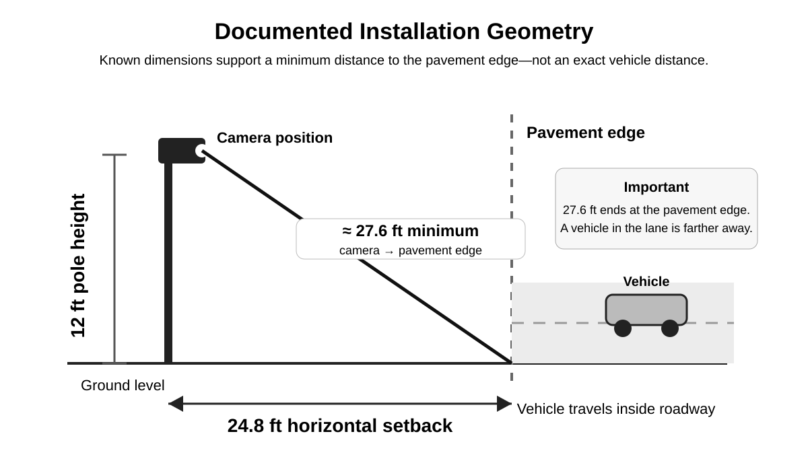
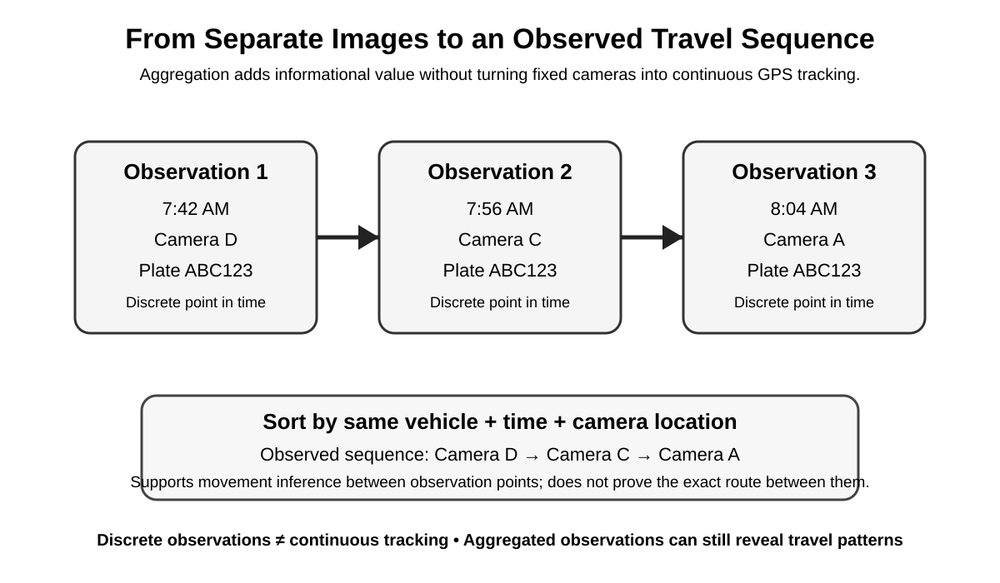

# Technical Assessment of Fixed ALPR Camera Geometry and Multi-Image Data

**Arkansas Accountability Project — Technical Working Paper**  
**Published: August 19, 2026**

> **Scope note:** This paper is intentionally limited to the physical camera installation, manufacturer-described capture characteristics, evidentiary limitations, and the informational significance of multiple ALPR observations when combined. Questions involving audit procedures, search authorization, supervisory approval, and government accountability are reserved for a separate paper.

## Executive Summary

A fixed automated license plate reader (ALPR) should not be evaluated solely as a camera that photographs a license plate. The roadside device is one component in a system that converts discrete vehicle observations into structured records containing, at minimum, a plate or plate interpretation, an image, a time, and a camera location. Manufacturer documentation also describes vehicle-characteristic classification and searches based on those characteristics.[^1][^2]

For the Sherwood installation examined in the Arkansas Accountability Project's records, the available installation drawing establishes two physical measurements:

- approximate camera/pole height: **12 feet**
- approximate horizontal setback from the edge of pavement: **24.8 feet**

Those measurements support one transparent geometric calculation:

\[
d=\sqrt{12^2+24.8^2}\approx27.6\text{ feet}
\]

Accordingly, **27.6 feet is the approximate minimum straight-line distance from the camera position to the documented edge of pavement**.

It is **not** the distance from the camera to a particular vehicle. A vehicle traveling within the roadway would normally be farther from the camera than the pavement edge. The current municipal record does not contain sufficient optical calibration information to calculate exact camera-to-vehicle distances from screenshots with defensible precision.

Flock Safety's current FAQ states that its license-plate-reading cameras can capture vehicles traveling up to 100 mph, day or night, and up to 75 feet away; that one camera is designed to cover approximately 1.5 lanes of traffic in one direction; and that motion detection operates to approximately 75 feet with a field about 20 feet wide at that distance.[^1] Those statements are useful manufacturer-described operating characteristics. They are **not a site-specific optical calibration** for the Sherwood installation.

The second focus of this paper is what happens when multiple discrete ALPR observations are combined. One observation establishes, at most, that a vehicle was observed at a particular camera at a particular time. Multiple observations sorted by time and location can reveal substantially more, including direction of movement, recurring travel corridors, repeated appearances, approximate timing patterns, and relationships between locations.

This does not mean that a stationary ALPR continuously follows a vehicle. It means that **multiple discrete observations can become more informative when aggregated**.

That distinction is central to an accurate description of ALPR technology.

---

## 1. Methodology and Evidentiary Standard

This paper uses five labels to distinguish levels of certainty.

### Documented municipal fact

A fact directly established by a municipal record, installation drawing, produced data record, or other government document in the project collection.

### Mathematical derivation

A calculation based on documented measurements.

### Manufacturer-described capability

A capability or specification stated by the manufacturer in public product documentation. Manufacturer claims are identified as such and are not treated as independent field validation.

### Reasonable inference

A conclusion supported by the available facts but dependent on one or more assumptions.

### Unknown or unverified

A technical detail that the current evidence does not establish.

This framework prevents a common analytical error: treating a plausible estimate as though it were a documented measurement.

---

## 2. Known Installation Geometry

The available installation drawing contains two useful dimensions.

### 2.1 Camera height

**Documented municipal fact:** approximately **12 feet**.

### 2.2 Horizontal setback

**Documented municipal fact:** approximately **24.8 feet from the edge of pavement**.

These measurements allow a minimum camera-to-roadway distance to be calculated without making assumptions about the camera lens.

*Figure 1. Simplified geometry based on the dimensions shown in the installation drawing. The 27.6-foot line terminates at the pavement edge, not at a vehicle.*

---

## 3. Deriving the 27.6-Foot Minimum

Using the Pythagorean theorem:

\[
d=\sqrt{(12)^2+(24.8)^2}
\]

\[
d=\sqrt{144+615.04}
\]

\[
d=\sqrt{759.04}
\]

\[
d\approx27.55\text{ feet}
\]

Rounded to one decimal place:

\[
\boxed{d\approx27.6\text{ feet}}
\]

### Finding

**Mathematical derivation:** the approximate straight-line distance from the camera position to the documented pavement edge is **27.6 feet**.

This is the strongest precise distance statement presently supported by the record.

---

## 4. Why 27.6 Feet Is Not a Vehicle Distance

The 27.6-foot calculation ends at the pavement edge.

A moving vehicle is ordinarily located inside the roadway. Therefore, the vehicle's plate or body would normally be farther from the camera than the nearest pavement edge.

The exact distance depends on variables not established by the two site-plan measurements alone, including:

- lane width;
- vehicle position within the lane;
- longitudinal position when the image was captured;
- camera yaw;
- camera pitch;
- roadway grade;
- plate height;
- and the exact point in the camera's field at which the image was captured.

A defensible public statement is therefore:

> **The documented geometry establishes approximately 27.6 feet as a minimum straight-line distance to the pavement edge. A vehicle traveling within the roadway would ordinarily be farther away, but the exact camera-to-vehicle distance cannot be established from the current municipal record alone.**

That is materially different from asserting a precise vehicle distance.

---

## 5. Why Exact Screenshot-Based Distance Estimates Should Not Be Published Yet

Perspective images contain spatial information, but reliable photogrammetric measurement normally requires camera calibration or known real-world reference geometry.

The current municipal record does not establish all of the following:

- exact sensor dimensions;
- exact focal length;
- optical center;
- lens distortion coefficients;
- exact horizontal optical field of view;
- exact vertical optical field of view;
- camera pitch, yaw, and roll;
- any digital crop applied before storage;
- perspective correction;
- exact road-plane geometry;
- lane centerlines;
- or a site-specific calibration image.

Without these values, a pixel coordinate in a screenshot cannot responsibly be converted into a precise real-world vehicle distance.

Accordingly, exact claims such as **47 feet**, **53 feet**, or **71 feet** should not be presented as measured facts unless later evidence supplies a defensible calibration method.

### Appropriate wording

> "The vehicle appears farther from the camera than the documented pavement edge."

### Not presently supported

> "The vehicle was exactly 53 feet from the camera."

The paper intentionally chooses the first form.

---

## 6. Manufacturer-Described Capture Characteristics

Flock Safety's current public FAQ provides several relevant statements about its license-plate-reading cameras.

According to Flock:

- cameras can capture vehicles traveling **up to 100 mph**;
- capture is described as operating **day and night**;
- plates can be captured **up to 75 feet away**;
- one LPR camera is designed to cover about **1.5 lanes in one direction**;
- motion detection operates to about **75 feet**; and
- the field at that distance is described as approximately **20 feet wide**.[^1]

These statements are useful for understanding the manufacturer's intended operating envelope.

They must be used carefully.

### What these statements support

They support the proposition that Flock publicly describes its fixed LPR product as being designed to capture vehicles across roadway distances substantially greater than the 27.6-foot minimum derived to the pavement edge.

### What these statements do not establish

They do not establish:

- the exact installed camera model or hardware revision at every municipal location;
- a site-specific focal length;
- exact camera-to-vehicle distance in a particular image;
- exact optical field-of-view angles;
- site-specific OCR accuracy;
- or the maximum distance at which every plate will be readable under every condition.

Manufacturer-described performance and site-specific measured performance are different categories of evidence.

---

## 7. Detection Area, Optical Field of View, and Recognition Range Are Not Identical

Several technical concepts are easy to collapse into one another.

### Motion-detection area

The area in which the system detects an event that may trigger processing or capture.

### Optical field of view

The physical scene projected onto the image sensor.

### Plate-recognition range

The conditions and distances under which a captured plate can be resolved and interpreted.

### Infrared illumination region

The portion of the scene receiving useful IR illumination for reflective plate capture.

These regions may overlap, but they are not necessarily identical.

Flock's statement that motion detection works to approximately 75 feet with a roughly 20-foot-wide field at that distance should therefore **not** be used as though it were a complete site-specific optical calibration.[^1]

---

## 8. What the Camera Record Contains

Flock's product materials describe LPR cameras as producing more than a plate number. Its platform materials describe **Vehicle Signature** searches using characteristics such as color, make, model, body type, and other distinctive vehicle features.[^2][^3]

For analytical purposes, a single ALPR observation can be modeled as:

\[
O=(P,V,T,L,I)
\]

where:

- \(P\) = plate or plate interpretation
- \(V\) = vehicle attributes
- \(T\) = timestamp
- \(L\) = camera/location
- \(I\) = associated image

Not every field has the same evidentiary status.

The image is a captured observation. Plate text and vehicle attributes may involve machine interpretation.

That distinction should remain visible in any forensic or policy analysis.

---

## 9. Machine Interpretation Should Be Distinguished From the Original Image

The system may associate automated classifications with an image, such as:

- plate characters;
- make;
- model;
- color;
- body type;
- or other vehicle characteristics.[^2][^3]

Those classifications can be useful investigative metadata.

They should not be treated as though the algorithmic label and the original image are identical forms of evidence.

A defensible hierarchy is:

1. **Original captured image**
2. **Timestamp and camera-location metadata**
3. **Machine-read plate result**
4. **Machine-generated vehicle classification**
5. **Human interpretation or investigative conclusion**

This distinction becomes particularly important when records from the same vehicle contain inconsistent automated vehicle descriptions.

An inconsistency in machine classification does not necessarily mean the underlying image depicts a different vehicle. It means the classification output itself must be interpreted cautiously.

---

## 10. One Image vs. Multiple Images

One ALPR observation is limited.

For example:

> **8:04 AM — Camera A — Plate ABC123**

That tells the viewer that the vehicle was observed at that point at that time, subject to the accuracy of the underlying record.

A second observation adds a relationship:

> **8:04 AM — Camera A**  
> **8:19 AM — Camera B**

A third adds another:

> **8:04 AM — Camera A**  
> **8:19 AM — Camera B**  
> **8:37 AM — Camera C**

The informational value does not increase merely because there are more photographs. It increases because the observations can be ordered by **time and location**.

*Figure 2. Multiple discrete observations can reveal a sequence even though no individual stationary camera continuously follows the vehicle.*

---

## 11. The Aggregation Effect

A single record may have modest informational value.

Multiple records associated with the same plate can be represented as:

\[
O_1=(P,L_1,T_1)
\]

\[
O_2=(P,L_2,T_2)
\]

\[
O_3=(P,L_3,T_3)
\]

When ordered by time:

\[
O_1\rightarrow O_2\rightarrow O_3
\]

the dataset can support inferences about movement between fixed observation points.

With enough observations, the records may reveal or help infer:

- direction of travel;
- repeated travel corridors;
- approximate travel times between cameras;
- recurring appearances at similar times;
- repeated presence near a location;
- frequency of travel;
- and relationships among multiple locations.

The exact strength of any inference depends on the completeness of the camera network and the observations available.

---

## 12. Discrete Observation Is Not Continuous Tracking

Precision in terminology is important.

A stationary ALPR camera does not necessarily document every point traveled between two camera locations.

Therefore, the following statement is too broad:

> "The camera continuously tracked the vehicle."

A more accurate statement is:

> **The system produced discrete observations at fixed camera locations that can be ordered chronologically to reconstruct portions of a vehicle's observed travel.**

This distinguishes ALPR data from continuous GPS telemetry while still recognizing the informational value of aggregated records.

Both facts can be true:

1. no individual fixed camera continuously follows the vehicle; and
2. multiple fixed-camera observations can retrospectively reveal meaningful portions of a vehicle's movement.

---

## 13. Example of Multi-Image Pattern Formation

Consider the following hypothetical sequence:

| Time | Camera | Direction |
|---|---|---|
| 7:42 AM | D | Eastbound |
| 7:56 AM | C | Southbound |
| 8:04 AM | A | Southbound |
| 5:11 PM | A | Northbound |
| 5:29 PM | C | Northbound |
| 5:44 PM | D | Westbound |

No single observation establishes a daily routine.

If materially similar sequences recur over multiple dates, however, an analyst could reasonably begin testing hypotheses such as:

- repeated morning travel in one direction;
- repeated evening return travel;
- recurring corridors;
- or approximate departure and return windows.

Those conclusions should still be labeled as **inferences from observed records**, not as proof of where the person was during unobserved intervals.

---

## 14. What Multiple Images Do Not Automatically Prove

Aggregated ALPR records have limits.

Even a sequence of observations generally does not, by itself, establish:

- who was driving;
- who owned the vehicle at that moment;
- the precise route traveled between cameras;
- whether the vehicle stopped between observations;
- the purpose of the trip;
- the identity of passengers;
- the destination intended by the driver;
- or activity occurring where no camera observation exists.

These limitations should accompany any public demonstration of multi-image travel reconstruction.

The appropriate claim is usually:

> **The records can reveal observed movement patterns and support travel inferences.**

Not:

> **The records prove every movement or activity of the person associated with the vehicle.**

---

## 15. Why Multiple Images Matter More Than "It's Just a License Plate"

The privacy significance of ALPR records is not dependent on a plate number being secret.

A plate is publicly displayed.

The analytical capability comes from adding:

- repeated observation;
- time;
- location;
- vehicle attributes;
- retention;
- and searchability.

A simplified representation is:

\[
\text{Plate alone}
\]

versus

\[
\text{Plate}+\text{Time}+\text{Location}+\text{Repeated observations}
\]

The second dataset answers questions that the plate itself cannot.

It can show **when and where the vehicle was observed**, and multiple records can reveal relationships among those observations.

The distinction is therefore one between **visibility of an identifier** and **aggregation of structured observations**.

---

## 16. Camera Density and Retention Affect Informational Value

The ability to reconstruct observed movement depends on the available dataset.

Two variables are particularly important.

### Camera coverage

More strategically distributed camera locations create more possible observation points.

### Retention

Longer retention creates a larger historical window in which observations can be compared.

Flock's public materials describe **30 days as its standard retention period**, while noting that retention may differ when law or local policy requires another period.[^4]

This paper does not treat a 30-day manufacturer default as proof of the exact retention setting for every Arkansas deployment.

Local implementation must be established from local records.

---

## 17. Evidence Matrix

| Question | Status | Basis |
|---|---|---|
| Approximate pole height | **Established** | Municipal installation drawing: ~12 ft |
| Horizontal setback to pavement edge | **Established** | Municipal installation drawing: ~24.8 ft |
| Minimum slant distance to pavement edge | **Derived** | Pythagorean calculation: ~27.6 ft |
| Exact distance to a photographed vehicle | **Not established** | Insufficient site-specific optical calibration |
| Manufacturer-described capture distance | **Manufacturer states up to 75 ft** | Flock FAQ |
| Manufacturer-described traffic coverage | **Manufacturer states ~1.5 lanes, one direction** | Flock FAQ |
| Manufacturer-described motion-detection range | **Manufacturer states ~75 ft** | Flock FAQ |
| Approximate width at 75 ft | **Manufacturer states ~20 ft** | Flock FAQ |
| Exact focal length at examined installation | **Not established** | Not present in current municipal record |
| Exact sensor dimensions | **Not established** | Not present in current municipal record |
| Exact optical field-of-view angles | **Not established** | Not present in current municipal record |
| Vehicle attribute classification | **Manufacturer-described capability** | Flock platform/product materials |
| Multiple records can be time-ordered | **Established analytical property** | Timestamped/location-associated records |
| Multiple records can support movement inferences | **Reasonable inference** | Depends on observed sequence and coverage |
| Continuous route between cameras | **Not established by ALPR observations alone** | Unobserved intervals remain |
| Driver identity from plate observation alone | **Not established** | Vehicle observation is not driver identification |

---

## 18. Source-of-Evidence Roadmap

Not every technical question should be directed to a municipal department.

### Municipal records are the appropriate source for

- installation drawings;
- camera locations;
- site-specific measurements;
- locally produced ALPR data;
- retention as locally implemented;
- and records showing how observations appear in actual municipal datasets.

### Manufacturer materials are the more appropriate source for

- product operating envelopes;
- general capture capabilities;
- product-family functionality;
- vehicle-classification capabilities;
- and proprietary engineering specifications the manufacturer elects to disclose.

### Independent technical testing would be required to validate

- site-specific capture accuracy by distance;
- OCR accuracy under varying lighting conditions;
- performance by vehicle speed;
- machine-classification accuracy;
- and precise photogrammetric calibration.

The absence of proprietary optical engineering records from a city should therefore not automatically be characterized as deficient municipal recordkeeping.

---

## 19. What Additional Technical Evidence Would Improve This Paper

The strongest additional evidence would be one or more of the following:

1. exact installed camera model and hardware revision;
2. manufacturer technical sheet for that exact model;
3. focal length and sensor dimensions;
4. horizontal and vertical optical field of view;
5. site-specific camera pitch and yaw;
6. roadway/lane survey dimensions;
7. an uncropped original image with known reference dimensions;
8. controlled test captures from known distances;
9. documentation explaining how vehicle classifications are generated;
10. metadata definitions for the produced ALPR records.

Until that evidence exists, the current paper deliberately stops short of precise site-specific optical claims.

---

## 20. Findings

### Finding 1 — Known geometry

The current installation drawing supports an approximate **12-foot pole height** and **24.8-foot horizontal setback from the pavement edge**.

### Finding 2 — Defensible minimum distance

Those measurements produce a transparent geometric minimum of approximately **27.6 feet from camera position to pavement edge**.

### Finding 3 — Vehicle distance remains unmeasured

The 27.6-foot value does not establish the distance to a vehicle traveling in the roadway.

### Finding 4 — Exact photogrammetry is not yet supported

The current record does not contain sufficient site-specific calibration information to publish exact camera-to-vehicle distances from screenshots.

### Finding 5 — Manufacturer specifications provide context, not site calibration

Flock publicly describes captures up to 75 feet, coverage of roughly 1.5 lanes in one direction, and a motion-detection field approximately 20 feet wide at 75 feet.[^1] These are manufacturer-described operating characteristics, not measurements of a particular Sherwood capture.

### Finding 6 — The system produces structured vehicle observations

Flock describes license-plate capture together with searchable vehicle characteristics, allowing records to contain more analytical information than a plate number alone.[^2][^3]

### Finding 7 — Multiple observations can reveal more than one observation

Time-ordered observations from different camera locations can support inferences about direction, recurring corridors, timing, and repeated travel.

### Finding 8 — Aggregation is not the same as continuous GPS tracking

Fixed ALPR observations remain discrete points. However, a sequence of discrete observations can retrospectively reconstruct portions of observed travel.

### Finding 9 — Inference has limits

ALPR observations alone generally do not establish who was driving, the exact route between cameras, trip purpose, passenger identity, or activity during unobserved intervals.

---

## 21. Conclusion

The most defensible technical description of a fixed ALPR system begins with careful separation of what is **measured**, what is **derived**, what the **manufacturer claims**, and what must remain an **inference**.

For the installation examined here, the strongest physical measurement finding is straightforward:

- camera/pole height: approximately **12 feet**
- horizontal setback from pavement edge: approximately **24.8 feet**
- derived minimum slant distance to pavement edge: approximately **27.6 feet**

That calculation should not be extended into unsupported claims about exact camera-to-vehicle distance.

The same discipline applies to the data.

One ALPR image is a discrete observation. Multiple observations, when connected by the same vehicle identifier and ordered by time and location, can become substantially more informative. They can support reconstruction of portions of observed movement even though the system does not continuously record every point between cameras.

The central technical distinction is therefore:

> **A publicly visible license plate is one piece of information. A retained, timestamped, location-indexed series of observations involving that plate is a different dataset.**

That conclusion does not depend on exaggerating the camera's optics or claiming continuous tracking.

It follows from the structure of the records themselves.

---

## Sources

[^1]: Flock Safety, **Frequently Asked Questions**, current manufacturer FAQ. Relevant statements describe captures up to 100 mph and 75 feet, approximately 1.5 lanes in one direction, and an approximately 20-foot-wide field at 75 feet. https://www.flocksafety.com/faq

[^2]: Flock Safety, **Flock Safety Platform**, describing Vehicle Signature searches using color, make, model, and unique vehicle features. https://www.flocksafety.com/products/flock-safety-platform

[^3]: Flock Safety, **License Plate Readers (LPR) Cameras**, describing Vehicle Signature search, real-time alerts, and related LPR platform capabilities. https://www.flocksafety.com/products/license-plate-readers

[^4]: Flock Safety, **Privacy & Ethics: Fact vs. Fiction**, stating that standard LPR retention is 30 days but may be increased or decreased when required by law or customer policy. https://www.flocksafety.com/privacy-ethics-copy

---

## Evidence Note

The **12-foot pole height** and **24.8-foot setback** used in this paper derive from the installation drawing retained in the Arkansas Accountability Project's Sherwood records collection. Before final public deployment, the site should link or cite the corresponding public/redacted exhibit if that installation drawing is already included in the project's evidence repository.

---

*Arkansas Accountability Project — Technical Working Paper — August 19, 2026*
